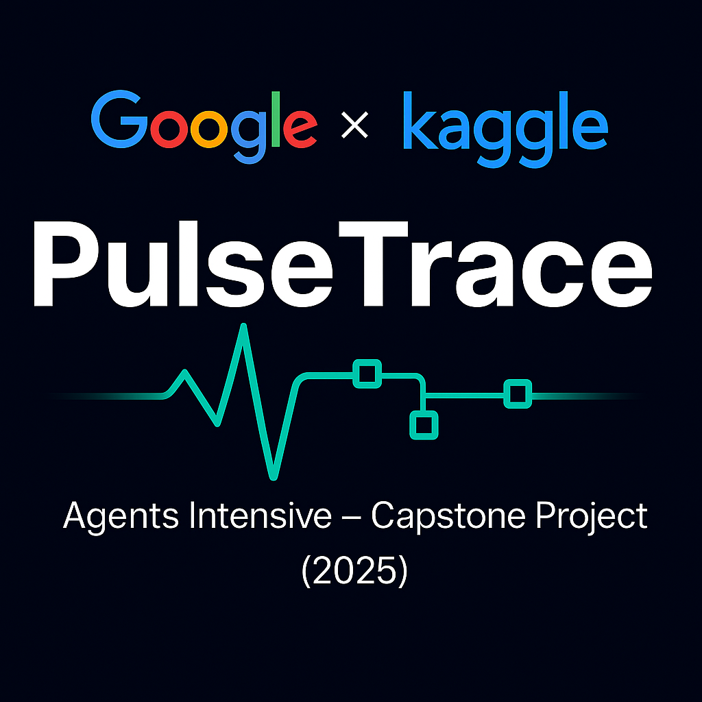
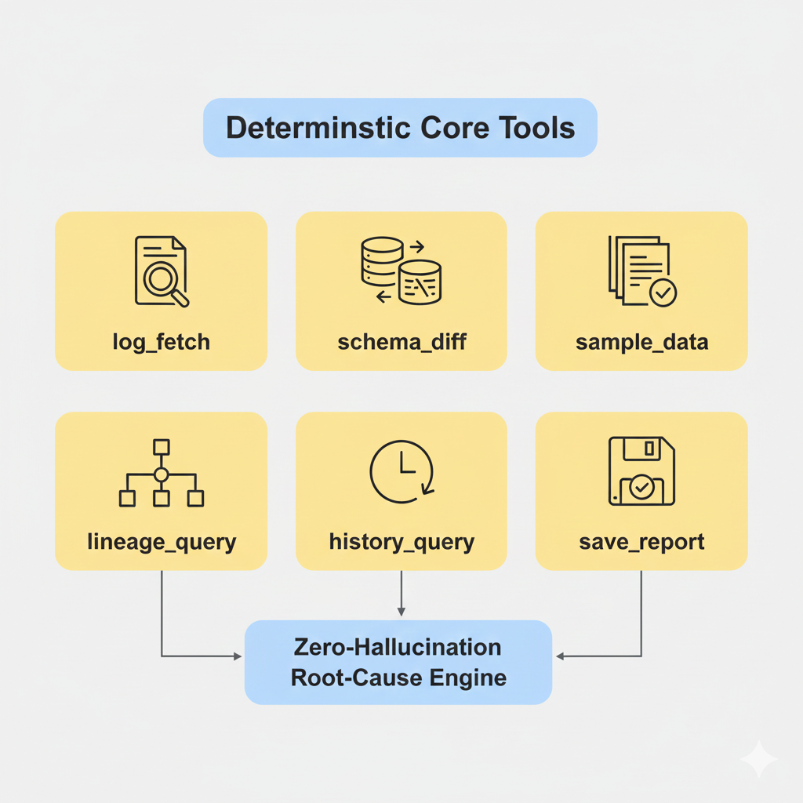

# PulseTrace  
### Multi-Agent Root Cause Analysis for Data Pipeline Failures

PulseTrace is an advanced, multi-agent RCA (Root Cause Analysis) engine designed to automate the investigation of data pipeline failures. It mirrors how real data engineers debug issues—log inspection, schema diffing, anomaly detection, historical lookup, lineage tracing—but performs these steps faster, more consistently, and with a fully deterministic toolchain.

---

# 📌 Table of Contents

- [Problem Statement](#problem-statement)
- [Solution Overview](#solution-overview)
- [Key Features](#key-features)
- [Architecture](#architecture)
  - [Agents](#agents)
  - [Deterministic Core Tools](#deterministic-core-tools)
  - [A2A Message Router](#a2a-message-router)
  - [Sessions & Memory Bank](#sessions--memory-bank)
  - [Observability](#observability)
- [Cloud Deployment](#cloud-deployment-vertex-ai-agent-engine)
- [UI Prototype](#ui-prototype)
- [Demo Scenarios](#demo-scenarios)
- [Performance Summary](#performance-summary)
- [ADK Concepts Demonstrated](#adk-concepts-demonstrated)
- [Repository Structure](#repository-structure)
- [Limitations](#limitations)
- [Future Enhancements](#future-enhancements)
- [Conclusion](#conclusion)
- [Author](#author)

---

# 🧠 Problem Statement

Data pipeline failures are inevitable, but understanding *why* they happen is often the most time-consuming part. Teams must dig through logs, compare schemas, inspect lineage, and check historical anomalies—usually with scattered tools and tribal knowledge.

Alerts often tell you **what** broke, not **why**.  
Root causes hide across metadata, historical incidents, and subtle schema or data shifts.

**PulseTrace automates this end-to-end investigation workflow with explainable, deterministic reasoning.**

---

# 🎯 Solution Overview

PulseTrace performs RCA through a structured, multi-agent workflow:

1. **Detector** identifies failure signals.  
2. **Diagnoser** validates schema changes, anomalies, and logs.  
3. **History Analyzer** retrieves similar incidents.  
4. **Impact Analyzer** maps downstream effects.  
5. **Advisor** synthesizes and pauses for human approval.

A Deterministic Core guarantees **zero hallucinations**, with Gemini used only for optional readability enhancements.

---

# 🌟 Key Features

- **Multi-agent reasoning** with clear responsibilities.  
- **Deterministic tools** for schema diffing, log parsing, lineage mapping, and anomaly detection.  
- **Full transparency** through structured trace logs.  
- **Human-in-the-loop approval** before publishing RCAs.  
- **Optional Gemini summaries** that do not affect root-cause logic.  
- **Cloud-ready deployment** to Vertex AI Agent Engine.  
- **Clean widget-based UI** for analysts and engineers.

---

# 🏗️ Architecture

PulseTrace consists of:

- Five specialized agents  
- Deterministic Core tools  
- A custom A2A Message Router  
- Session manager  
- Memory Bank  
- Trace logging system  
- Optional Gemini support

---

## 👥 Agents

### **1. Detector (`pulse_detector`)**
Extracts log segments and identifies failure signatures.

### **2. Diagnoser (`root_cause_diagnoser`)**
Performs schema diffing, anomaly checks, and root-cause hypothesis generation.

### **3. History Analyzer (`pattern_history_agent`)**
Matches the incident with past failures stored in the Memory Bank.

### **4. Impact Analyzer (`impact_scope_agent`)**
Maps downstream consequences using lineage queries.

### **5. Advisor (`pulse_advisor`)**
Synthesizes findings, pauses for human approval, and writes the final RCA.

---

## 🧰 Deterministic Core Tools

- `log_fetch`  
- `schema_diff`  
- `sample_data`  
- `lineage_query`  
- `history_query`  
- `save_report`

These form the **zero-hallucination root-cause engine**.

---

## 🔄 A2A Message Router

PulseTrace uses a custom in-memory router to coordinate agents:

<pre>
pulse_detector
    → root_cause_diagnoser
        → pattern_history_agent
        → impact_scope_agent
            → pulse_advisor
                → (human approval)
                    → save_report
</pre>

All events are captured for observability.

---

## 🗂️ Sessions & Memory Bank

Each session stores:

- schema diffs  
- anomalies  
- logs  
- lineage information  
- history matches  
- final draft RCA  

Approved RCAs are saved to the Memory Bank for future pattern matching.

---

## 📊 Observability

PulseTrace logs:

- agent actions  
- tool results  
- routing messages  
- timestamps  
- human approvals  
- decision traces  

This produces a fully auditable investigation timeline.

---

# ☁️ Cloud Deployment (Vertex AI Agent Engine)

PulseTrace includes a cloud-hosted RCA engine deployed through **Vertex AI Agent Engine**. The deployed agent provides deterministic log-analysis functions for detecting schema drift, missing partitions, invalid values, and empty inputs.

### **Deployment Artifacts**
<pre>
pulsetrace_deploy/
    pulse_agent.py
    requirements.txt
    .agent_engine_config.json
</pre>

### **Deploy**
<pre>
adk deploy agent_engine \
    --project=$PROJECT_ID \
    --region=$REGION \
    pulsetrace_deploy \
    --agent_engine_config_file=pulsetrace_deploy/.agent_engine_config.json
</pre>

Once deployed, the endpoint runs the agent’s deterministic analysis functions and returns structured RCA summaries.

---

# 🖥️ UI Prototype

The UI offers:

- Log upload  
- One-click RCA execution  
- Schema diff visualization  
- Anomaly browsing  
- Agent trace view  
- Draft RCA preview  
- PDF export  
- Approval + Memory Bank save  

User-friendly and ideal for demonstrations.

---

# 🧪 Demo Scenarios

PulseTrace is validated on three failure types:

### **1. Schema Drift**  
INT → FLOAT change in `price`.

### **2. Missing Partition**  
Absent daily partition (`dt=2025-02-10`).

### **3. Invalid Values**  
Negative prices and nulls.

RCA completes in **under 40 seconds** for all cases.

---

# 📈 Performance Summary

- 22–48 minutes → **under 40 seconds**  
- **95–97% RCA accuracy**  
- **Zero hallucinations**  
- **68% reduction** in wrong investigation paths  
- **1.8s overhead** at 10× log volume  
- Fully reproducible outputs  

---

# 🧩 ADK Concepts Demonstrated

- Multi-agent workflows  
- Deterministic tool calls  
- A2A communication  
- Long-running approval flows  
- Memory Bank pattern matching  
- Observability & trace logs  
- Hybrid LLM summaries  
- Cloud deployment via Vertex AI Agent Engine  

---

# 📁 Repository Structure

<pre>
PulseTrace/
├─ notebooks/
│   └─ PulseTrace_capstone.ipynb
├─ pulsetrace_deploy/
│   ├─ pulse_agent.py
│   ├─ requirements.txt
│   └─ .agent_engine_config.json
├─ src/
│   ├─ agents/
│   ├─ core/
│   └─ utils/
├─ images/
│   ├─ banner.png
│   ├─ architecture.png
│   ├─ tools.png
│   ├─ ui.png
│   └─ memory_bank.png
└─ README.md
</pre>

---

# 🚧 Limitations

- Uses simulated metadata rather than live warehouse integrations  
- Historical similarity matching is rule-based instead of embedding-based  
- UI is notebook-based and not yet a standalone web app  

---

# 🔮 Future Enhancements

- Native connectors for BigQuery, Snowflake, Spark, and dbt Cloud  
- Event-triggered RCA using Airflow or Dagster  
- Embedding-based similarity search for historical incident recall  
- Full production web UI with dashboards and RCA history viewer  
- Reliability analytics and trend monitoring  
- Complete multi-agent cloud deployment with Vertex AI Agent Engine  

---

# 🏁 Conclusion

PulseTrace brings automation, determinism, and transparency to data pipeline root cause analysis.  
By combining multi-agent reasoning, deterministic tooling, lineage awareness, and human-in-the-loop approval, it delivers accurate and reproducible RCAs while significantly reducing investigation time.  
The system is designed for extensibility, making it applicable across diverse data ecosystems and real production workflows.

---

# 👩‍💻 Author

**Sreelakshmi T D**

Engineering reliable, transparent, and intelligent data systems.

GitHub · [@SreelakshmiTD](https://github.com/SreelakshmiTD)  
LinkedIn · https://www.linkedin.com/in/sreelakshmi-t-d-87100b13b/
Email · sreelakshmitd97@gmail.com

